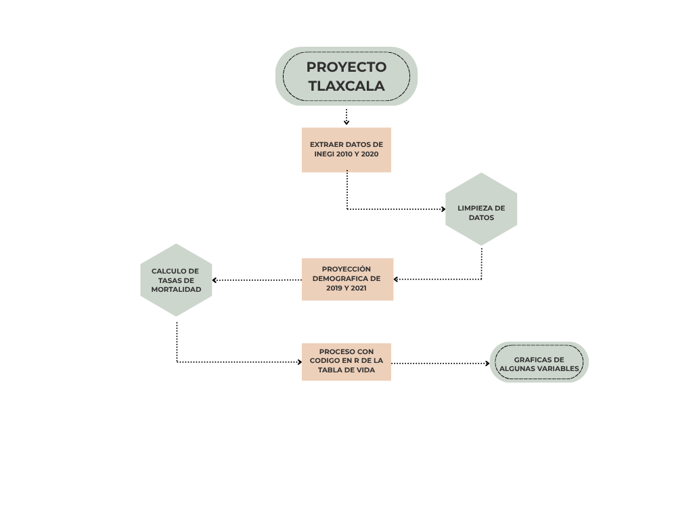

\newpage

# Introducción

El estudio de la mortalidad y la supervivencia en una población requiere, como paso analítico fundamental, la comprensión de su estructura por edad y sexo. Esta composición no solo es el resultado de eventos demográficos pasados (fecundidad, mortalidad y migración), sino que constituye la base biológica sobre la cual se proyectan los riesgos epidemiológicos y las demandas de infraestructura social. En el caso de Tlaxcala, esta estructura presenta matices particulares derivados de su escala territorial y su acelerada transición demográfica.

La siguiente gráfica presenta la pirámide de población de Tlaxcala proyectada al año 2026. Este gráfico de barras dobles permite observar de manera instantánea la distribución etaria del estado. A diferencia de las estructuras expansivas de décadas anteriores, la pirámide actual muestra un perfil de tipo constrictivo.

Este estrechamiento de la base indica una reducción sostenida en los niveles de fecundidad, mientras que el abultamiento en los grupos de edad adulta (20 a 45 años) evidencia el peso del bono demográfico. No obstante, el ensanchamiento gradual de la cúspide advierte sobre un proceso de envejecimiento poblacional en marcha, donde la mayor supervivencia femenina subraya una feminización de la vejez que debe ser considerada en las políticas de salud pública.

```{r echo=FALSE, message=FALSE, warning=FALSE}

#| echo: false
#| message: false
#| warning: false

# Remover los objetos
rm(list = ls())

# Paquetes 

library(lubridate)
library(data.table)
library(ggplot2)
library(dplyr)
library(tidyr)
#library(kableExtra)
library(readxl)
#library(tinytex)

# Descargar tablas de datos
pop <- fread("https://repodatos.atdt.gob.mx/CONAPO/proyecciones/00_Pob_Mitad_1950_2070.csv")

# Filtrar Estado

tlx <- pop[ENTIDAD == "Tlaxcala" & ANIO == "2026", .(SEXO, EDAD, POBLACION)]

```

```{r echo=FALSE, message=FALSE, warning=FALSE}

# Agrupamos por rangos de 5 años para que coincida con la imagen
tlx_pyramid <- tlx %>%
  mutate(EDAD_GRP = cut(EDAD, 
                        breaks = c(seq(0, 85, by = 5), Inf), 
                        labels = c("0-4", "5-9", "10-14", "15-19", "20-24", "25-29", 
                                   "30-34", "35-39", "40-44", "45-49", "50-54", "55-59", 
                                   "60-64", "65-69", "70-74", "75-79", "80-84", "85+"), 
                        right = FALSE)) %>%
  group_by(SEXO, EDAD_GRP) %>%
  summarise(POBLACION = sum(POBLACION)) %>%
  ungroup()

# Convertimos la población de "Hombres" en negativa para el efecto espejo
tlx_pyramid <- tlx_pyramid %>%
  mutate(POBLACION_GRAF = ifelse(SEXO == "Hombres", -POBLACION, POBLACION))

# 6. Generar la gráfica con ggplot2
ggplot(tlx_pyramid, aes(x = EDAD_GRP, y = POBLACION_GRAF, fill = SEXO)) +
  geom_col() +
  coord_flip() + # Voltea la gráfica para que las barras sean horizontales
  scale_y_continuous(labels = abs) + # Muestra valores absolutos (sin el signo menos)
  scale_fill_manual(values = c("Hombres" = "#a651a1", "Mujeres" = "#009688")) + # Colores de tu imagen
  theme_minimal() +
  labs(title = "Población De Tlaxcala (2026)",
       subtitle = "Distribución por edad y sexo",
       x = "Grupos de Edad", 
       y = "Población",
       fill = "Sexo") +
  theme(legend.position = "bottom")

```

Para cuantificar las observaciones de la pirámide, se han calculado los siguientes indicadores clave que sintetizan la realidad del estado:

### Edad Mediana:

Situada en los 28 años, este indicador divide a la población en dos grupos numéricamente iguales, confirmando que Tlaxcala es aún un estado joven, pero con una tendencia clara hacia la madurez.

### Índice de Masculinidad:

Con una proporción de 93 hombres por cada 100 mujeres, se observa un superávit femenino que se acentúa en las edades avanzadas, factor determinante para el análisis de la mortalidad diferencial por sexo.

### Relación de Dependencia:

Este indicador mide la carga económica potencial de la población en edades no productivas (niños y adultos mayores) sobre la población en edad de trabajar. La estructura actual sugiere una ventana de oportunidad económica (bono demográfico), aunque la creciente informalidad laboral (70.9%) limita la capacidad de ahorro y previsión para el retiro de estos grupos.

Esta caracterización demográfica sirve como marco de referencia para analizar las tablas de vida que se presentan a continuación. En ellas, examinaremos el comportamiento de la población de los años 2010, 2019 y 2021, observando la evolución de las funciones de supervivencia ($l_x$), defunciones (${}_nd_x$), riesgo de mortalidad (${}_nm_x$) y esperanza de vida ($e^0_x$) principalmente a través de los diferentes rangos de edad.

# Diagrama de Flujo

A continuación, se presenta el diagrama de flujo el cual representa los pasos a seguir para llegar a nuestra tabla de vida y ademas visualizar algunas de las variables en una gráfica, como lo son $l_x$, ${}_nd_x$, ${}_nm_x$ y $e^0_x$, se calcularan todas pero nos enfocaremos en estas en la parte visual.

{fig-align="center" width="110%"}

\clearpage

# Datos de la Población en los Años 2010 y 2020

Primero que todo obtendremos los datos necesarios por medio de INEGI en formato csv y xlsx, los cuales nos interesan la población y las defunciones en ciertos rangos de edades diferenciadas por género, los datos obtenidos estan junto con otros años, pero gracias a excel podemos filtar los datos que nos interesan y asi tenerlos limpios, estos son los datos obtenidos gracias a la limpieza de los censos de los años 2010 y 2020 tanto de hombres como de mujeres:

```{r echo=FALSE, message=FALSE, warning=FALSE}

deaths10 <- fread("data/2010Tlx_N,D.csv")
knitr::kable(
  deaths10,
  caption = "Tabla de Tlx 2010"
)

deaths20 <- fread("data/2020Tlx_N,D.csv")
knitr::kable(
  deaths20,
  caption = "Tabla de Tlx 2020"
)

```

\textcolor{violet}{Nota: La notación de x es igual a la edad, al igual que la de n que se vera despues es los años que se avanzan, por ejemplo: ${}_nd_x$=${}_5d_{10}$ son las defunciones de edades entre 10 y 15 años}

Para conocer la población del 2019 y 2021, nos acercaremos con la "predicción exponencial", pues no hay censos de la poblacion en esos años, ya que son cada 10 años en México, usaremos los censos de población y defunciones en el 2010 y 2020, lo haremos por cada género. Lo fundamental es proyectar al 30 de junio, ya que esa "población a mitad de año" representa la población media o expuesta al riesgo, esto es muy util sin la nacesidad de tner un censo en estos años.

# Metodología

Para el cálculo de las tablas de mortalidad en años intercensales (2019 y 2021), es necesario establecer un puente matemático entre los censos de 2010 y 2020. A continuación, se definen las funciones algorítmicas que permiten proyectar tanto el volumen poblacional como las defunciones, asumiendo una tasa de crecimiento constante por grupo de edad.

Para proyectar la población y defunciones a mitad de año ($t = 2019.5, 2021.5$), primero se determina la tasa de crecimiento intercensal ($r$) entre 2010 ($t_0$) y 2020 ($t_T$): $$r = \frac{\ln(N_T / N_0)}{t_T - t_0}$$ Posteriormente, el volumen proyectado al tiempo $t$ se define como: $$N_t = N_0 \cdot e^{r(t - t_0)}$$

Esto es la teoría de lo que se realizo en excel para obtener los datos de 2019 y 2021 a partir de los censos de 2010 y 2020. Se tiene la tabla con las tasas de crecimiento intercensal entre 2010 y 2020

```{r}
tci <- fread("https://raw.githubusercontent.com/GilMelancolico/Tlaxcala_Proyecto_Demografia-9219/main/data/tci2010_2020.csv")
knitr::kable(
  tci,
  caption = "Tabla de Tasas de Crecimiento Intercensal entre 2010 y 2020"
)

```

A partir de estas se estimaron las poblaciones y defunciones en 2019 y 2021.

```{r}
deaths19 <- fread("https://raw.githubusercontent.com/GilMelancolico/Tlaxcala_Proyecto_Demografia-9219/main/data/deaths19.csv")
knitr::kable(
  deaths19,
  caption = "Población y defunciones de Tlaxcala estimadas para 2019"
)

deaths21 <- fread("https://raw.githubusercontent.com/GilMelancolico/Tlaxcala_Proyecto_Demografia-9219/main/data/deaths21.csv")
knitr::kable(
  deaths21,
  caption = "Población y defunciones de Tlaxcala estimadas para 2021"
)

```

### Tasas Centrales de Mortalidad

($_nm_x$)Una vez proyectados los insumos a mitad de año, se calculan las tasas centrales de mortalidad para cada grupo de edad $[x, x+n)$ y por sexo, mediante el cociente de las defunciones proyectadas ($_{n}D_x$) entre la población media o expuesta al riesgo ($_{n}K_x$): $$_nm_x = \frac{_{n}D_x}{_{n}K_x}$$

### Funciones de la Tabla de Vida

A partir de las tasas centrales de mortalidad (${}_nm_x$), se derivan las funciones biométricas mediante las siguientes relaciones:

-   Probabilidad de fallecer ($\mathbf{{}_nq_x}$): Se transforma la tasa central en probabilidad asumiendo una distribución de las defunciones $a_x$ en el intervalo $[x, x+n)$: $${}_nq_x = \frac{n \cdot m_x}{1 + (n - a_x)m_x}$$ Donde $q_\omega = 1$ para el último grupo de edad.

-   Sobrevivientes ($\mathbf{l_x}$): Partiendo de un radicual de $l_0 = 100,000$: $$l_{x+n} = l_x \cdot (1 - q_x)$$

-   Defunciones teóricas ($_{n}d_x$): $$_{n}d_x = l_x - l_{x+n}$$

-   Años-persona vividos ($\mathbf{{}_nL_x}$): Representa el tiempo vivido por la cohorte en el intervalo: $${}_nL_x = n \cdot l_{x+n} + a_x \cdot _{n}d_x$$ Para el grupo abierto final: $L_\omega = \frac{l_\omega}{m_\omega}$

-   Esperanza de vida ($\mathbf{e_x}$): $$e_x = \frac{T_x}{l_x} \quad \text{donde} \quad T_x = \sum_{i=x}^{\omega} L_i$$

-   Ajuste de Coale-Demeny para $\mathbf{a_x}$: para los primeros dos grupos de edad ($0$ y $1-4$), se utiliza el ajuste de Coale-Demeny para determinar la fracción de tiempo vivido, ya que la mortalidad infantil no es uniforme:

    -   Si $m_0 \geq 0.107$: $a_0 = 0.330$ (H) o $0.350$ (M).
    -   Si $m_0 < 0.107$: $a_0 = 0.045 + 2.684 \cdot m_0$ (H) o $0.053 + 2.800 \cdot m_0$ (M)

De esta manera obtenemos los datos para la tabla de vida de 2010, 2019 y 2021 diferenciada por hombres y mujeres, para observar como se comportan las variables con nuestros datos

```{r echo=FALSE, message=FALSE, warning=FALSE}

ruta_archivo <- "C:/Users/Mario Escobar/Downloads/Ciencias/Demografia/Demography_9219/Demography_9219/data/Tlx_tabla_mort.xlsx"

tlaxcala <- read_excel(
  ruta_archivo,
  sheet = "2010"
)

# Renombrar columnas
tlaxcala <- tlaxcala %>%
  
  rename(
    x = 1,
    n = 2,
    K_h = 3,
    K_m = 4,
    D_h = 5,
    D_m = 6
  ) %>%
  
  mutate(
    x = ifelse(x == "95+", 95, x),
    
    x = as.numeric(x),
    n = as.numeric(n),
    
    K_h = as.numeric(K_h),
    K_m = as.numeric(K_m),
    
    D_h = as.numeric(D_h),
    D_m = as.numeric(D_m)
  )

### Función de proyección exponencial
expo <- function(K_0, K_T, t_0, t_T, t){
  
  # Reemplazar NA
  
  K_0[is.na(K_0)] <- 0.5
  K_T[is.na(K_T)] <- 0.5
  
  # Reemplazar ceros
  
  K_0[K_0 == 0] <- 0.5
  K_T[K_T == 0] <- 0.5
  
  # crecimiento exponencial
  
  r <- log(K_T / K_0) / (t_T - t_0)
  
  K_t <- K_0 * exp(r * (t - t_0))
  
  return(K_t)
}


### Funcion Tabla de vida

lt_abr <- function(x, n, mx, sex = "h"){

  m <- length(x)

  ax <- n/2

  # Ajuste Coale-Demeny edad 0

  if(sex == "h"){

    ax[1] <- ifelse(
      mx[1] >= 0.107,
      0.330,
      0.045 + 2.684 * mx[1]
    )

  } else {

    ax[1] <- ifelse(
      mx[1] >= 0.107,
      0.350,
      0.053 + 2.800 * mx[1]
    )
  }

  # Ajuste edad 1-4

  if(sex == "h"){

    ax[2] <- ifelse(
      mx[1] >= 0.107,
      1.352,
      1.651 + 2.816 * mx[1]
    )

  } else {

    ax[2] <- ifelse(
      mx[1] >= 0.107,
      1.361,
      1.522 + 1.518 * mx[1]
    )
  }

  # qx

  qx <- (n * mx) / (1 + (n - ax) * mx)

  qx[m] <- 1

  # px

  px <- 1 - qx

  # lx

  lx <- 100000 * cumprod(c(1, px[-m]))

  # dx

  dx <- c(-diff(lx), lx[m])

  # Lx

  Lx <- n * c(lx[-1], 0) + ax * dx

  Lx[m] <- lx[m] / mx[m]

  # Tx

  Tx <- rev(cumsum(rev(Lx)))

  # ex

  ex <- Tx / lx

  data.table(
    x, n, mx, ax, qx, px, lx, dx, Lx, Tx, ex
  )
}

# TABLA HOMBRES

mx_h <- tlaxcala$D_h / tlaxcala$K_h

tabla_hombres <- lt_abr(
  x = tlaxcala$x,
  n = tlaxcala$n,
  mx = mx_h,
  sex = "h"
)

# TABLA MUJERES

mx_m <- tlaxcala$D_m / tlaxcala$K_m

tabla_mujeres <- lt_abr(
  x = tlaxcala$x,
  n = tlaxcala$n,
  mx = mx_m,
  sex = "f"
)

```

\clearpage

```{r echo=FALSE, message=FALSE, warning=FALSE, results='asis'}

## hombres 2010

cat("\\setlength{\\tabcolsep}{2pt}") 
cat("\\tiny") 

knitr::kable(
  tabla_hombres,
  format = "latex",
  booktabs = TRUE,
  caption = "Tabla de Vida Tlaxcala 2010 (H)",
  align = "c",
  digits = 4,
  format.args = list(
    big.mark = ".",
    decimal.mark = ","
  )
)

cat("\\normalsize")
cat("\\setlength{\\tabcolsep}{6pt}")

## mujeres 2010

cat("\\setlength{\\tabcolsep}{2pt}") 
cat("\\tiny") 

knitr::kable(
  tabla_mujeres,
  format = "latex",
  booktabs = TRUE,
  caption = "Tabla de Vida Tlaxcala 2010 (M)",
  align = "c",
  digits = 4,
  format.args = list(
    big.mark = ".",
    decimal.mark = ","
  )
)

cat("\\normalsize")
cat("\\setlength{\\tabcolsep}{6pt}")

```

\clearpage

```{r echo=FALSE, message=FALSE, warning=FALSE}

### 2019

tlx19 <- read_excel(ruta_archivo, sheet = "2019")

tlx19 <- tlx19 %>%
  rename(x = 1, n = 2, K_h = 3, K_m = 4, D_h = 5, D_m = 6) %>%
  mutate(
    x = as.numeric(ifelse(x == "95+", 95, x)),
    n = as.numeric(n)
  )

tabla_h19 <- lt_abr(
  x = tlx19$x, 
  n = tlx19$n, 
  mx = tlx19$D_h / tlx19$K_h, 
  sex = "h"
)

tabla_m19 <- lt_abr(
  x = tlx19$x, 
  n = tlx19$n, 
  mx = tlx19$D_m / tlx19$K_m, 
  sex = "f"
)

### 2021

tlx21 <- read_excel(ruta_archivo, sheet = "2021")

tlx21 <- tlx21 %>%
  rename(x = 1, n = 2, K_h = 3, K_m = 4, D_h = 5, D_m = 6) %>%
  mutate(
    x = as.numeric(ifelse(x == "95+", 95, x)),
    n = as.numeric(n)
  )

tabla_h21 <- lt_abr(
  x = tlx21$x, 
  n = tlx21$n, 
  mx = tlx21$D_h / tlx21$K_h,
  sex = "h"
)

tabla_m21 <- lt_abr(
  x = tlx21$x, 
  n = tlx21$n, 
  mx = tlx21$D_m / tlx21$K_m, 
  sex = "f"
)

```

\clearpage

```{r echo=FALSE, message=FALSE, warning=FALSE, results='asis'}

### Tablas 2019 y 2021

# 2019 H

cat("\\setlength{\\tabcolsep}{2pt}") 
cat("\\tiny") 

knitr::kable(
  tabla_h19,
  format = "latex",
  booktabs = TRUE,
  caption = "Tabla de Vida Tlaxcala 2019 (H)",
  align = "c",
  digits = 4,
  format.args = list(big.mark = ".", decimal.mark = ",")
)

# 2019 M

knitr::kable(
  tabla_m19,
  format = "latex",
  booktabs = TRUE,
  caption = "Tabla de Vida Tlaxcala 2019 (M)",
  align = "c",
  digits = 4,
  format.args = list(big.mark = ".", decimal.mark = ",")
)

# 2021 H

knitr::kable(
  tabla_h21,
  format = "latex",
  booktabs = TRUE,
  caption = "Tabla de Vida Tlaxcala 2021 (H)",
  align = "c",
  digits = 4,
  format.args = list(big.mark = ".", decimal.mark = ",")
)

# 2021 M

knitr::kable(
  tabla_m21,
  format = "latex",
  booktabs = TRUE,
  caption = "Tabla de Vida Tlaxcala 2021 (M)",
  align = "c",
  digits = 4,
  format.args = list(big.mark = ".", decimal.mark = ",")
)

cat("\\normalsize")
cat("\\setlength{\\tabcolsep}{6pt}")

```

\clearpage

Aqui hay una tabla mas compacta sobre las esperanzas de vida de las mujeres y hombres en 2010, 2019 y 2021

```{r echo=FALSE, message=FALSE, warning=FALSE}

# 1. Creamos el data frame con los valores de e0 (primera fila de ex)
resumen_esperanza <- data.frame(
  Año = c("2010", "2019", "2021"),
  Hombres = c(
    tabla_hombres$ex[1], 
    tabla_h19$ex[1], 
    tabla_h21$ex[1]
  ),
  Mujeres = c(
    tabla_mujeres$ex[1], 
    tabla_m19$ex[1], 
    tabla_m21$ex[1]
  )
)

# 2. Calculamos la brecha por sexo (opcional, pero muy común en la Facultad)
resumen_esperanza$Brecha <- resumen_esperanza$Mujeres - resumen_esperanza$Hombres

# 3. Generamos la tabla con knitr::kable
knitr::kable(
  resumen_esperanza,
  digits = 2,
  align = "c",
  booktabs = TRUE,
  col.names = c("Año", "Hombres ($e_0$)", "Mujeres ($e_0$)", "Brecha (M - H)"),
  escape = FALSE,
  caption = "Comparativa de la Esperanza de Vida al Nacer en Tlaxcala (2010-2021)"
)

```

El análisis de ($e_0$) en Tlaxcala revela un retroceso histórico, destacando una caída considerable en la longevidad masculina que pasó de 75.00 años en 2010 a tan solo 64.71 años en 2021. Este descenso, que se agudizó durante el periodo intercensal y postcensal, indica que la crisis sanitaria impactó sobre una tendencia de supervivencia que ya venía bajo presión, situando la $e_0$ de los hombres en niveles comparables a décadas pasadas. Resulta particularmente alarmante que la brecha de género se haya duplicado con creces, escalando de 3.83 a 8.79 años de diferencia a favor de las mujeres; esta marcada sobremortalidad masculina evidencia que los factores de riesgo están "castigando desproporcionadamente "castigando" a los varones en el estado, afectando la estabilidad de la transición demográfica en la región.

# Visualización de Resultados: Gráficas

Estas son las gráficas de $l_x$, ${}_nd_x$ y ${}_nm_x$ respecto a los datos obtenidos de hombres y mujeres de los años 2010, 2019 y 2021

```{r echo=FALSE, message=FALSE, warning=FALSE}

### H 2010 lx, ndx y nmx

par(mfrow = c(1,3))
plot(tabla_hombres$x, tabla_hombres$lx, type = "l", lwd = 2, col = "blue", xlab = "Edad", ylab = "lx", main = "lx (H 2010)")
plot(tabla_hombres$x, tabla_hombres$dx, type = "l", lwd = 2, col = "red", xlab = "Edad", ylab = "dx", main = "ndx (H 2010)")
plot(tabla_hombres$x, tabla_hombres$mx, type = "l", log = "y", lwd = 2, col = "black", xlab = "Edad", ylab = "mx", main = "nmx (H 2010)")

### M 2010 lx, ndx y nmx
par(mfrow = c(1,3))
plot(tabla_mujeres$x, tabla_mujeres$lx, type = "l", lwd = 2, col = "blue", xlab = "Edad", ylab = "lx", main = "lx (M 2010)")
plot(tabla_mujeres$x, tabla_mujeres$dx, type = "l", lwd = 2, col = "red", xlab = "Edad", ylab = "dx", main = "ndx (M 2010)")
plot(tabla_mujeres$x, tabla_mujeres$mx, type = "l", log = "y", lwd = 2, col = "black", xlab = "Edad", ylab = "mx", main = " nmx (M 2010)")
par(mfrow = c(1,1))

```

\clearpage

```{r echo=FALSE, message=FALSE, warning=FALSE}

### H 2019 lx, ndx y nmx

par(mfrow = c(1,3))
plot(tabla_h19$x, tabla_h19$lx, type = "l", lwd = 2, col = "blue", xlab = "Edad", ylab = "lx", main = "lx (H 2019)")
plot(tabla_h19$x, tabla_h19$dx, type = "l", lwd = 2, col = "red", xlab = "Edad", ylab = "dx", main = "mdx (H 2019)")
plot(tabla_h19$x, tabla_h19$mx, type = "l", log = "y", lwd = 2, col = "black", xlab = "Edad", ylab = "mx", main = "mmx (H 2019)")

### M 2019 lx, ndx y nmx

par(mfrow = c(1,3))
plot(tabla_m19$x, tabla_m19$lx, type = "l", lwd = 2, col = "blue", xlab = "Edad", ylab = "lx", main = "lx (M 2019)")
plot(tabla_m19$x, tabla_m19$dx, type = "l", lwd = 2, col = "red", xlab = "Edad", ylab = "dx", main = "ndx (M 2019)")
plot(tabla_m19$x, tabla_m19$mx, type = "l", log = "y", lwd = 2, col = "black", xlab = "Edad", ylab = "mx", main = "nmx (M 2019)")
par(mfrow = c(1,1))

```

\clearpage

```{r echo=FALSE, message=FALSE, warning=FALSE}

### H 2021 lx, ndx y nmx
par(mfrow = c(1,3))
plot(tabla_h21$x, tabla_h21$lx, type = "l", lwd = 2, col = "blue", xlab = "Edad", ylab = "lx", main = "lx (H 2021)")
plot(tabla_h21$x, tabla_h21$dx, type = "l", lwd = 2, col = "red", xlab = "Edad", ylab = "dx", main = "ndx (H 2021)")
plot(tabla_h21$x, tabla_h21$mx, type = "l", log = "y", lwd = 2, col = "black", xlab = "Edad", ylab = "mx", main = "nmx (H 2021)")

### M 2021 lx, ndx y nmx
par(mfrow = c(1,3))
plot(tabla_m21$x, tabla_m21$lx, type = "l", lwd = 2, col = "blue", xlab = "Edad", ylab = "lx", main = "lx (M 2021)")
plot(tabla_m21$x, tabla_m21$dx, type = "l", lwd = 2, col = "red", xlab = "Edad", ylab = "dx", main = "ndx (M 2021)")
plot(tabla_m21$x, tabla_m21$mx, type = "l", log = "y", lwd = 2, col = "black", xlab = "Edad", ylab = "mx", main = "nmx (M 2021)")
par(mfrow = c(1,1))

```

\clearpage

Aqui estan las gráficas de la esperanza de vida de los años 2010, 2019 y 2021 diferenciadas entre hombres y mujeres

```{r echo=FALSE, message=FALSE, warning=FALSE}

### e_x Hombres

# Comparamos 2010, 2019 y 2021

par(mfrow = c(1,3))

plot(tabla_hombres$x, tabla_hombres$ex, type = "l", lwd = 2, col = "darkgreen", 
     xlab = "Edad", ylab = "ex", main = "ex 2010")

plot(tabla_h19$x, tabla_h19$ex, type = "l", lwd = 2, col = "darkgreen", 
     xlab = "Edad", ylab = "ex", main = "ex H 2019")

plot(tabla_h21$x, tabla_h21$ex, type = "l", lwd = 2, col = "darkgreen", 
     xlab = "Edad", ylab = "ex", main = "ex H 2021")


### e_x Mujeres
# Comparamos 2010, 2019 y 2021

par(mfrow = c(1,3))

plot(tabla_mujeres$x, tabla_mujeres$ex, type = "l", lwd = 2, col = "darkgreen", 
     xlab = "Edad", ylab = "ex", main = "ex M 2010")

plot(tabla_m19$x, tabla_m19$ex, type = "l", lwd = 2, col = "darkgreen", 
     xlab = "Edad", ylab = "ex", main = "ex M 2019")

plot(tabla_m21$x, tabla_m21$ex, type = "l", lwd = 2, col = "darkgreen", 
     xlab = "Edad", ylab = "ex", main = "ex M 2021")

# Resetear el panel a 1x1
par(mfrow = c(1,1))

```

\clearpage

# Analisis de Resultados

El impacto de la crisis sanitaria en Tlaxcala se manifiesta como un choque demográfico que interrumpió la dinámica de sobrevivencia de la población.

Al comparar el escenario pre-pandemia (2019) con el pico de la crisis (2021), observamos una caída en la esperanza de vida al nacer ($\boldsymbol{e_0}$) de 2.01 años en hombres y 1.04 años en mujeres, este descenso no es uniforme, sino que se concentra en el aumento drástico de las tasas de mortalidad ($\boldsymbol{{}_nm_x}$) en edades adultas y avanzadas.

En los hombres, el riesgo de morir en el grupo de 60 a 65 años aumentó de 0.0342 a 0.0418, lo que representa un incremento del 22% en la intensidad mortal para ese rango de edad en solo dos años, esta "sobremortalidad" provocó que la cohorte de sobrevivientes ($\boldsymbol{l_x}$) se redujera, mientras que en 2019 el 48% de los hombres alcanzaba los 70 años, para 2021 esa cifra bajó al 42%.

En las mujeres, aunque el impacto fue menor, la tendencia en las defunciones ($\boldsymbol{{}_nd_x}$) a partir de los 50 años afirma que la pandemia actuo afecto considerablemente, revirtiendo años de ganancias en salud publica y dejando una estructura poblacional con una menor probabilidad de alcanzar edades mas grandes.

## Datos Extra:

-   la mortalidad infantil (${}_1m_0$ o $m_0$) en las tablas de 2021 no se disparo tanto como la de adultos. Esto confirma la teoría de que el COVID-19 fue "selectivo" de cierta manera.

-   La cantidad de personas que llegan a los 90 años ($\boldsymbol{l_{90}}$) pasó de 6,489 en 2019 a solo 4,609 en 2021, es decir, se perdio un 30% aproximadamente
